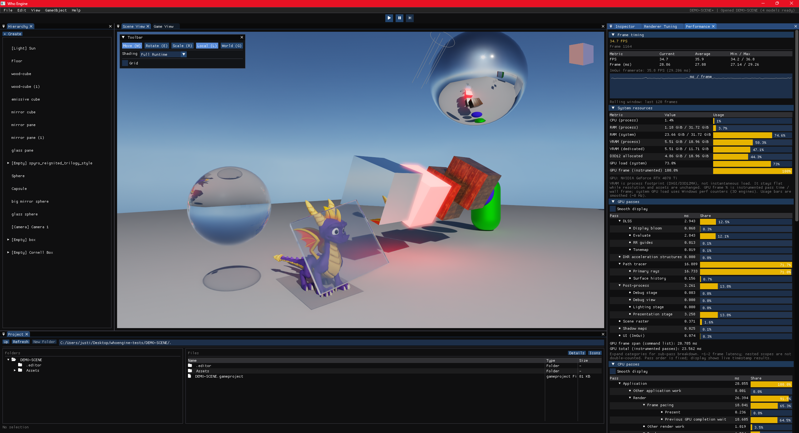
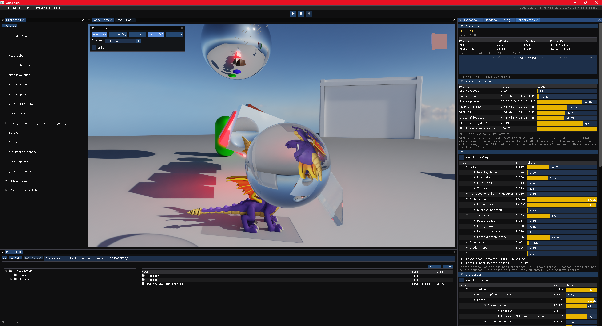
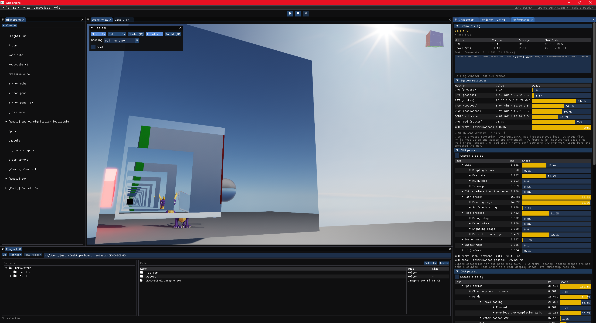
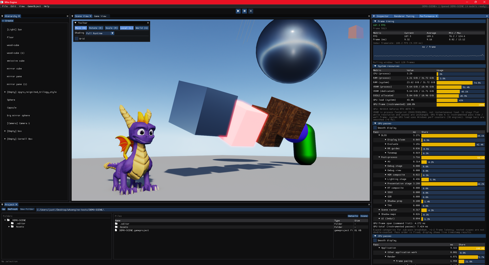
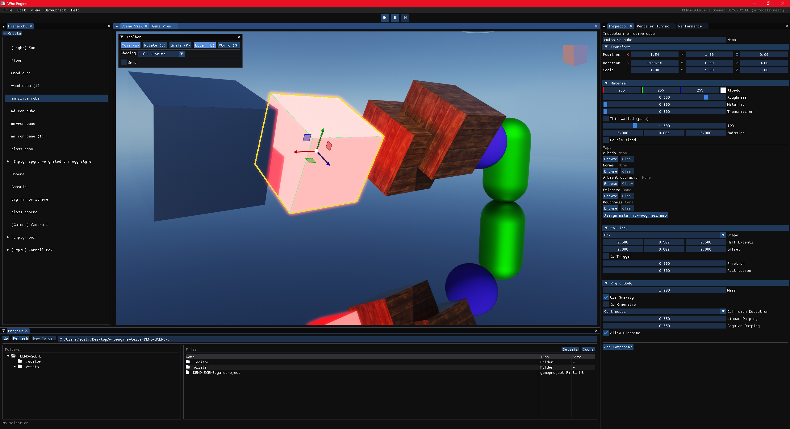
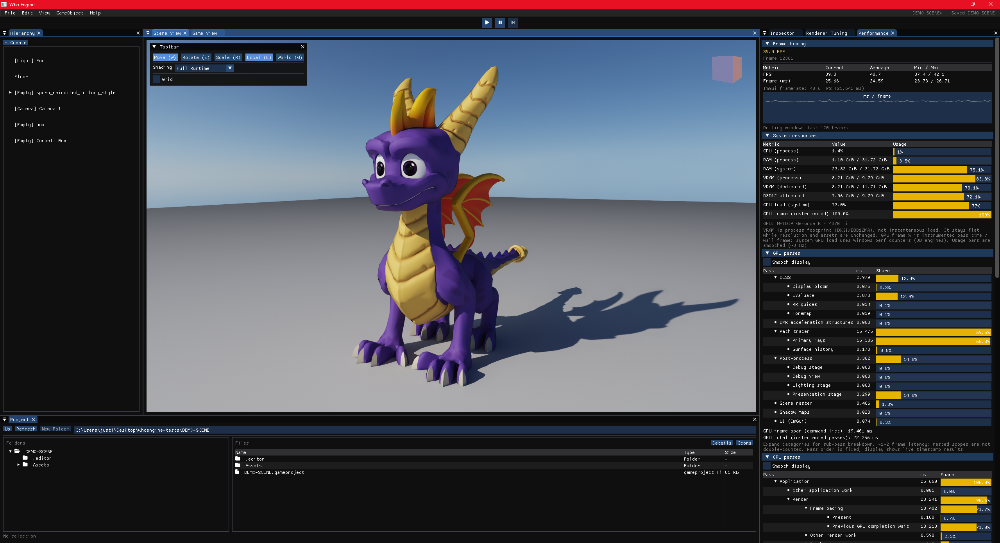

# D3D12 Scene Editor & Renderer

A Windows D3D12 scene editor and real-time rendering sandbox. Import glTF assets, assemble and
inspect scenes in a docked ImGui editor, tune the renderer live, and switch between raster, hybrid
DXR, and path-traced views. Play mode runs the authored scene with Jolt physics.

The project focuses on renderer architecture and the editor tooling needed to iterate on it: modern
deferred PBR, optional hardware ray tracing, temporal rendering, neural reconstruction, and GPU
diagnostics all live in the same application.

## Build

Requires Windows 10/11, Visual Studio 2022, CMake 3.20+, and the Windows SDK (D3D12 and DXC).

```powershell
cmake -S . -B build
cmake --build build --config Debug --target game-engine
.\build\Debug\game-engine.exe
```

Optional: copy `dxcompiler.dll` and `dxil.dll` into `vendor/dxc/x64/` before building (see [vendor/dxc/README.md](vendor/dxc/README.md)).

Shaders are HLSL compiled at runtime with DXC (Shader Model 6.0). Albedo textures use `DXGI_FORMAT_R8G8B8A8_UNORM_SRGB`; linear maps (normal, roughness, AO) use `DXGI_FORMAT_R8G8B8A8_UNORM`.

### D3D12 debug layer (optional)

The D3D12 debug layer is **off by default**. It only activates in **Debug** builds when enabled at configure time:

```powershell
# Enable (reconfigure, then rebuild Debug)
cmake -S . -B build -DGAME_ENGINE_D3D12_DEBUG_LAYER=ON
cmake --build build --config Debug --target game-engine

# Disable again
cmake -S . -B build -DGAME_ENGINE_D3D12_DEBUG_LAYER=OFF
cmake --build build --config Debug --target game-engine
```

Validation messages and GPU-based validation slow things down noticeably; use this when debugging D3D12 lifetime or barrier issues. Release builds ignore the flag.

## Tests

### Interactive runner (recommended)

```powershell
.\scripts\run-tests.ps1

# Non-interactive (useful for scripts / quick runs):
.\scripts\run-tests.ps1 -Run Cpu
.\scripts\run-tests.ps1 -Run Gpu -Tier 1                  # cumulative smoke (default GpuMode=Through)
.\scripts\run-tests.ps1 -Run Gpu -GpuMode Exact -Tier 4        # gpu-dxr only
.\scripts\run-tests.ps1 -Run Gpu -GpuMode Custom -Tiers "1, 2, 4"
.\scripts\run-tests.ps1 -Run List
```

Menu-driven runner with green `[PASS]` / red `[FAIL]` output and a final `x/y tests passed in …` summary. Supports all CPU tests, GPU tiers, individual test selection, and listing what's available.

### CPU tests

Registered with CTest; no GPU window required.

```powershell
cmake --build build --config Debug --target engine-tests descriptor-heap-tests

# Run directly (stdout shows pass/fail lines)
.\build\Debug\engine-tests.exe
.\build\Debug\engine-tests.exe --list
.\build\Debug\engine-tests.exe --filter=material
.\build\Debug\descriptor-heap-tests.exe

# Or via CTest from the build directory (CPU only by default)
cd build
ctest -C Debug -L cpu --output-on-failure
```

`engine-tests` covers shadow math, lighting probes, materials, guide encoding, shader compile smoke, and related CPU-side checks. `descriptor-heap-tests` covers the fixed descriptor heap allocator.

### GPU render tests

Requires a real D3D12 device and RTX for tier 4 (DXR). **Not** part of default `ctest`, use the `gpu` label explicitly.

```powershell
cmake -S . -B build -DGAME_ENGINE_BUILD_D3D12_RENDER_TESTS=ON
cmake --build build --config Debug --target d3d12-render-tests

# Tier 1 smoke (default) — shared D3D12 session, 32×32 offscreen for boolean draw tests
.\build\Debug\d3d12-render-tests.exe
.\build\Debug\d3d12-render-tests.exe --through=1
.\build\Debug\d3d12-render-tests.exe --tier=4          # gpu-dxr only (2 tests)
.\build\Debug\d3d12-render-tests.exe --through=2       # tiers 1..2 (cumulative)
.\build\Debug\d3d12-render-tests.exe --tiers=1,3       # smoke + editor tiers only
.\build\Debug\d3d12-render-tests.exe --tiers=2-4
.\build\Debug\d3d12-render-tests.exe --filter=TestPbr*
.\build\Debug\d3d12-render-tests.exe --list
.\build\Debug\d3d12-render-tests.exe --all             # every registered test

# Via CTest (from build directory; never runs unless you pass -L gpu)
cd build
ctest -C Debug -L gpu-smoke --output-on-failure
ctest -C Debug -L gpu-pbr --output-on-failure
ctest -C Debug -L gpu-dxr --output-on-failure
ctest -C Debug -L gpu-dxr-pt --output-on-failure
ctest -C Debug -L gpu --output-on-failure
```

**Tiers:** `1` gpu-smoke, `2` gpu-pbr, `3` gpu-editor, `4` gpu-dxr, `5` gpu-dxr-pt. Use `--tier=N` for a single tier, `--through=N` for cumulative 1..N, `--tiers=EXPR` for ranges/sets (`1,3`, `2-4`, `1-3,5`), or `--all`.

On success you should see `[PASS]` lines per test and `N/N tests passed.` with exit code `0`. Failures print `[FAIL]` and assertion details to stderr. DXR tests print `SKIP: ... (no RTX tier)` and exit `0` when hardware lacks ray tracing. Use `--list` to inspect the tests available in a built configuration.

## Features

### Scene editor and runtime

- Docked Scene View, Game View, Hierarchy, Inspector, Renderer Tuning, Project Files, and Performance panels
- glTF mesh, material, and texture import with scene-project serialization
- Object placement, transform gizmos, multi-selection, undo/redo, and scene hierarchy editing
- Play mode backed by Jolt physics
- Runtime feature/capability reporting for the active GPU and ray-tracing support

### Core lighting

- Deferred metallic/roughness PBR with a multi-render-target G-buffer
- HDR image-based lighting from environment maps, including skybox or solid-background modes
- Directional sun lighting with cascaded shadow maps and PCF/PCSS filtering options
- HDR composition, selectable gamma/Reinhard/ACES tonemapping, and bloom
- Material textures, normal mapping, tangent-space generation, and GPU-friendly asset handling

### Screen space

- Ambient occlusion: SSAO or GTAO (edge-aware denoise on GTAO)
- Screen-space reflections (SSR) with trace quality scaling and SVGF spatial/temporal denoise
- Screen-space global illumination (SSGI) with noise injection, spatial blur, and temporal accumulation
- Anti-aliasing: none, TAA, FXAA, SMAA, SSAA, and MSAA
- Motion vectors, depth, normal, albedo, and roughness guides for temporal rendering and reconstruction

### Ray tracing and path tracing (optional DXR hardware)

Hybrid mode keeps the raster base and adds RT passes on top:

- Specular reflections (stochastic trace, NRD RELAX specular denoise)
- Soft directional sun shadows (NRD SIGMA shadow denoise)
- One-bounce diffuse GI (NRD RELAX diffuse denoise; mutually exclusive with SSGI inject)
- Hardware acceleration structures, opaque visibility queries, and capability-based DXR fallbacks

Path traced mode replaces the hybrid stack with a unified path tracer:

- Real-time single-frame rendering for interactive work
- Progressive reference accumulation
- Environment and emissive direct lighting, multiple bounces, transmissive visibility, and HDR environments
- ReSTIR direct illumination with initial candidates plus temporal and spatial reuse
- ReSTIR GI reservoir generation and temporal reuse
- Depth, motion, material, and lighting guides for denoising and reconstruction

### NVIDIA upscaling (Streamline, optional)

- DLSS Super Resolution and DLAA (native-res DLSS as pure AA)
- DLSS Ray Reconstruction (neural denoise + upscale over the RT/HDR signal when enabled)

DLSS features compile out or no-op on non-NVIDIA hardware.

### Diagnostics and validation

- Debug views for G-buffer, lighting, AO, SSR, SSGI, ray tracing, ReSTIR, and reconstruction inputs
- Per-pass GPU timings in the Performance panel
- Render-diagnostics export and automated CPU/GPU test coverage
- Optional D3D12 debug layer for resource lifetime and barrier investigation

## Visual Showcase

<p align="center">
<br>
<em>Path Tracing: real-time multi-bounce path tracing with environment lighting, emissive lighting, and progressive accumulation.</em>
</p>

<hr>

<p align="center">
<br>
<em>Transmissive Path Tracing: refraction and transmissive visibility through the sphere, including objects visible through the refracted path.</em>
</p>

<hr>

<p align="center">
<br>
<em>Recursive Reflections: multiple reflection bounces between opposing mirrors. The dark termination in the deepest self-reflections is a known limitation in the current mirror bounce/termination handling.</em>
</p>

<hr>

<p align="center">
<br>
<em>Deferred Raster Rendering: the demo scene rendered through the rasterized PBR pipeline with ray tracing and path tracing disabled.</em>
</p>

<hr>

<p align="center">
<br>
<em>Scene Editing: interactive scene editing with object selection, transform gizmos, and real-time renderer updates.</em>
</p>

<hr>

<p align="center">
<br>
<em>Asset Rendering: imported glTF assets rendered through the path-traced pipeline.</em>
</p>

<details>
<summary>Editor & Runtime Demos</summary>

### Hierarchy Editing

https://github.com/user-attachments/assets/f7d93836-051a-48bd-a2f6-694be10b0d00

<p align="center">
<em>Reparenting: objects can be reorganized through the scene hierarchy and transformed interactively, with parent/child relationships preserved.</em>
</p>

### Play Mode & Physics

https://github.com/user-attachments/assets/88ee3d03-7c22-4b75-9dbe-af48fd0d1dcb

<p align="center">
<em>Play Mode: the authored scene can be simulated at runtime with Jolt physics.</em>
</p>

### Multi-Selection & Undo/Redo

https://github.com/user-attachments/assets/81c6b969-9c3d-4880-acf2-6ccbb3dc2f28

<p align="center">
<em>Multi-Selection & Undo/Redo: marquee selection, multi-object transforms, scaling, and undoing scene edits directly in the editor. Note the leftover splotch on the skybox where the Spyro asset previously sat after an undo, a known rendering artifact still being tracked down.</em>
</p>

</details>
